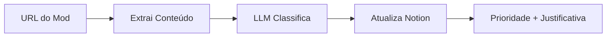

# TS4 Mod Priority Classifier

Sistema automatizado de classificação de prioridade de mods de The Sims 4 (0-5) com integração Notion, usando LLM para análise baseada em roteiro estruturado.

## 📚 Visão Geral

Este projeto automatiza o processo de classificação de mods do The Sims 4 usando Inteligência Artificial. O sistema:

1. **Extrai** conteúdo de páginas de mods automaticamente
2. **Analisa** usando LLM (Large Language Model) com base em roteiro estruturado
3. **Classifica** em escala de prioridade 0-5 com sub-categorias
4. **Atualiza** automaticamente sua database do Notion

### Sistema de Prioridades

- **Priority 0 (Cinza)**: Sem interesse/incompatibilidade
- **Priority 1 (Vermelho)**: Core/Framework/Dependência essencial
- **Priority 2 (Amarelo)**: Gameplay importante
- **Priority 3 (Verde)**: Gameplay relevante localizado
- **Priority 4 (Azul)**: Hobby/Storytelling
- **Priority 5 (Roxo)**: Visual/Estético

## 🚀 Como Funciona



## 🛠️ Instalação

### Pré-requisitos

- Python 3.8+
- Conta no Notion com API Token
- API Key de LLM (OpenAI ou Anthropic)

### Passos

1. **Clone o repositório:**
```bash
git clone https://github.com/thebossrrpg/ts4-mod-priority-classifier.git
cd ts4-mod-priority-classifier
```

2. **Instale as dependências:**
```bash
pip install -r requirements.txt
```

3. **Configure as variáveis de ambiente:**
```bash
cp config/example.env .env
```

Edite o arquivo `.env` com suas credenciais:
```env
NOTION_TOKEN=seu_token_aqui
NOTION_DATABASE_ID=seu_database_id_aqui
LLM_API_KEY=sua_api_key_aqui
```

## 💻 Uso

### Classificar um mod

```bash
python src/main.py <url_do_mod> <notion_page_id>
```

**Exemplo:**
```bash
python src/main.py "https://modthesims.info/d/12345" "abc123def456"
```

### Saída esperada:

```
Classificação concluída:
Prioridade: 3 (Verde)
Sub-categoria: 3C - Família & Relações Pontuais
Justificativa: Mod adiciona interações familiares relevantes...
```

## 📋 Estrutura do Projeto

```
ts4-mod-priority-classifier/
├── config/
│   └── example.env          # Template de configurações
├── docs/
│   ├── Manual de Classificação de Mods The Sims 4 v3.0.md
│   ├── Manual de Sub-classificação de Mods_ Versão 3.0.md
│   └── Manual-Classificacao-Prioridades-Mods-TS4.md
├── prompts/
│   ├── RESUMO-PROJETO.md
│   └── classificador-mods-ts4-prompt.md  # Prompt do LLM
├── src/
│   └── main.py              # Script principal
├── .gitignore
├── LICENSE
├── README.md
└── requirements.txt
```

## 🔧 Configuração do Notion

### Propriedades necessárias na database:

- **Priority** (Select): Opções 0-5
- **Priority Label** (Select): Cinza, Vermelho, Amarelo, Verde, Azul, Roxo
- **Notes** (Text): Para justificativas e sub-categorias

### Sub-categorias (incluídas no Notes):

**Priority 3 (Verde):**
- 3A: Gameplay & Mecânicas Gerais
- 3B: Eventos, Tradições & Feriados
- 3C: Família & Relações Pontuais
- 3D: Trabalho, Carreira & Educação
- 3E: Objetos Funcionais & Hobbies
- 3F: QoL & Ajustes de Interface

**Priority 4 (Azul):**
- 4A: Hobby/Atividade menor
- 4B: Sistema de narrativa/storytelling
- 4C: Customização menor
- 4D: Cenas/interações estéticas

**Priority 5 (Roxo):**
- 5A: CAS (roupas, cabelos, acessórios)
- 5B: Build/Buy
- 5C: Reshades/Presets
- 5D: Mundo/Lotes
- 5E: Animações/Poses

## 🤖 Sobre o LLM

O sistema utiliza prompts estruturados para classificar mods baseado em:

1. **Impacto de Remoção** (0-4 pontos)
2. **Framework/Dependência** (0-1 ponto)
3. **Essencialidade** (0-3 pontos)

**Score final** = remoção + framework + essencial (0-8)

O score é convertido em prioridade:
- Score ≥ 7 → Priority 1 (Vermelho)
- Score 5-6 → Priority 2 (Amarelo)
- Score 3-4 → Priority 3 (Verde)
- Score 2 → Priority 4 (Azul)
- Score ≤ 1 → Priority 0 (Cinza)

## ⚠️ Importante

- O sistema **ACRESCENTA** informações ao campo Notes, sem sobrescrever conteúdo existente
- Sub-categorias são fornecidas apenas para Priority 3, 4 e 5
- Sempre revise as classificações geradas pelo LLM

## 📝 Documentação Adicional

Consulte a pasta `docs/` para:
- Manual completo de classificação
- Manual de sub-categorias
- Exemplos de uso

## 📜 Licença

MIT License - veja o arquivo [LICENSE](LICENSE) para detalhes.

## 🤝 Contribuições

Contribuições são bem-vindas! Por favor, abra uma issue ou pull request.

---

**Desenvolvido para otimizar o gerenciamento de mods de The Sims 4** 🎮
